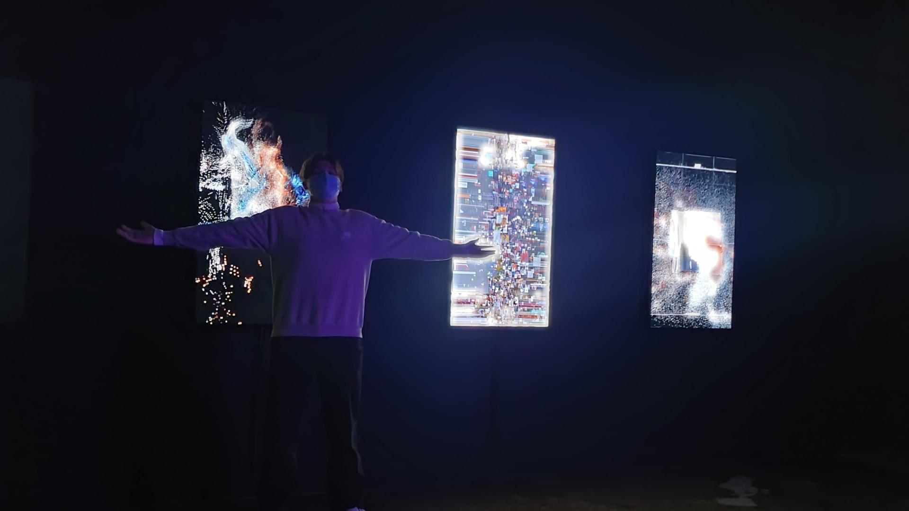
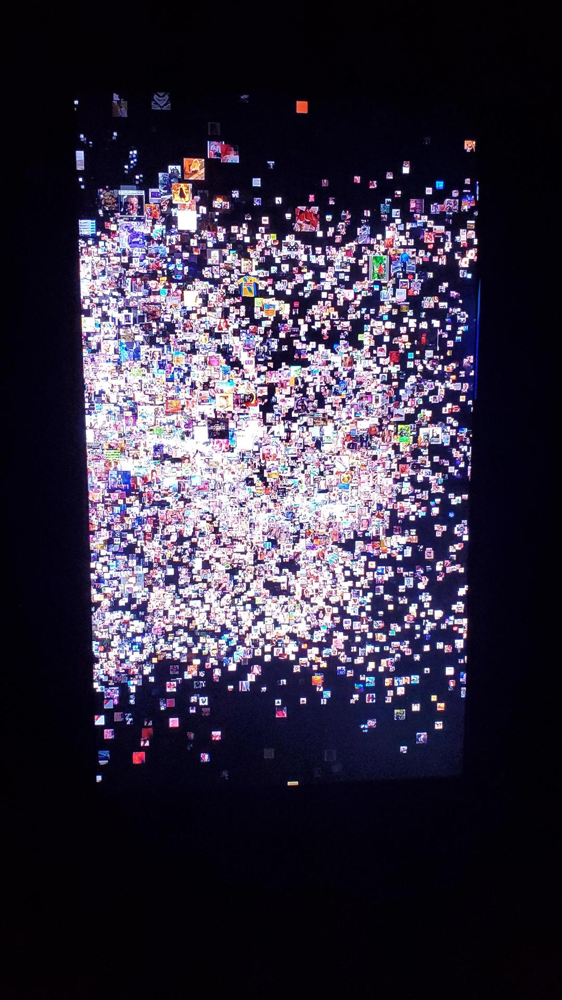

# Titre de l'oeuvre ou de la réalisation 

ALTER EGO

## Nom de l'artiste ou de la firme

Cadie Desbiens-Desmeules est une artiste médiatique canadienne qui travaille entre l'art génératif et la performance en direct. Sa pratique est soit spécifique au site, soit basée sur l'installation, couvrant de multiples surfaces ou environnements immersifs. S'appuyant sur son expérience en tant que journaliste, elle pose un regard critique sur les tendances technologiques avec des oeuvres d'art qui suscitent des réflexions et des discussions internes sur la façon dont nous comprenons et agissons avec les nouvelles technologie.

source: cartel de l'oeuvre

photo: Martin Laporte

## Année de réalisation

2020

## Nom de l'exposition ou de l'événement 

Cinquième édition de la biennale internationale d'art numérique 

## Lieu de mise en exposition 

ARSENAL CONTEMPORARY ART MONTREAL 2020, rue William, Montréal, H3J 1R8 

## Date de votre visite 

9 février 2022 

## Description de l'oeuvre ou du dispositif multimédia 

Au fur et à mesure que les images sont publiées, elles sont réorganisées pour prendre la forme d'"influenceurs" générés par l'IA. L'idée de l'artiste est de créer des « influenceurs » IA composés d'images individuelles de personnes qui sont souvent engagées dans ce comportement de style influenceur. Comme l'IA est formée à l'aide de l'apprentissage automatique et des visages disponibles en ligne, les visages les plus nombreux sont ceux des célébrités. Les visages composites qui en résultent reflètent les conventions dominantes de la beauté et la façon dont la plate-forme encourage un certain type de contenu. Le fait qu'une IA crée des visages ressemblant à ceux utilisés par les annonceurs pour influencer nos comportements et nos habitudes de consommation, et que ces images soient composées de personnes souvent engagées dans le même comportement d'influenceur, montre à quel point les frontières entre contenu commercial et contenu authentiquement produit sont devenues floues.

source: site de l'artiste ( https://desbiens-desmeules.com/alter-ego/ )
## Explications sur la mise en espace de l'oeuvre ou du dispositif 

Il y a cinq écrans plats accrochés à un mur. Toute la pièce est très sombre ce qui permet une vision plus que correct de l'oeuvre. Il y a des cache fils pour faire plus propre et les ordinateurs sont cachés dans un coin de cette pièce.

## Liste des composantes et techniques de l'oeuvre ou du dispositif 

5 écrants plats et 2 ordinateurs.

## Liste des éléments nécessaires pour la mise en exposition 

Cinq fils et des caches-fils qui descendent de chaque écrans pour ce rendre vers l'ordinateur.

## Expérience vécue 

Je me suis questionner sur notre utilisation des réseaux sociaux. En voyant tout ces influenceurs comme des clones qui se multiplient, j'ai réalisé que nous passons beaucoup trop de temps à idéaliser ces gens qui semble si parfaits

## Description de votre expérience de l'oeuvre ou du dispositif, de l'interactivité, des gestes à poser, etc. 

Il n'y a aucun geste à poser puisqu'il s'agit d'une oeuvre contemplative.

## Ce qui vous a plu, vous a donné des idées et justifications 

J'ai beaucoup aimé le fait que je ne devais rien faire pour faire fonctionner l'oeuvre ( oui je suis paresseux ). Le message de l'oeuvre permet de comprendre ce qui se passe sous nos yeux aussi bien sur les écrans que dans notre réalité.

## Aspect que vous ne souhaiteriez pas retenir pour vos propres créations ou que vous feriez autrement et justifications 

Il y avait des éléments qui était pareil sur certains écrans. Personellement, je voudrais faire en sorte que les éléments soient tous différents d'un écran à l'autre.

## Références
Site de l'artiste:
https://desbiens-desmeules.com/alter-ego/

Cartel de l'oeuvre:

