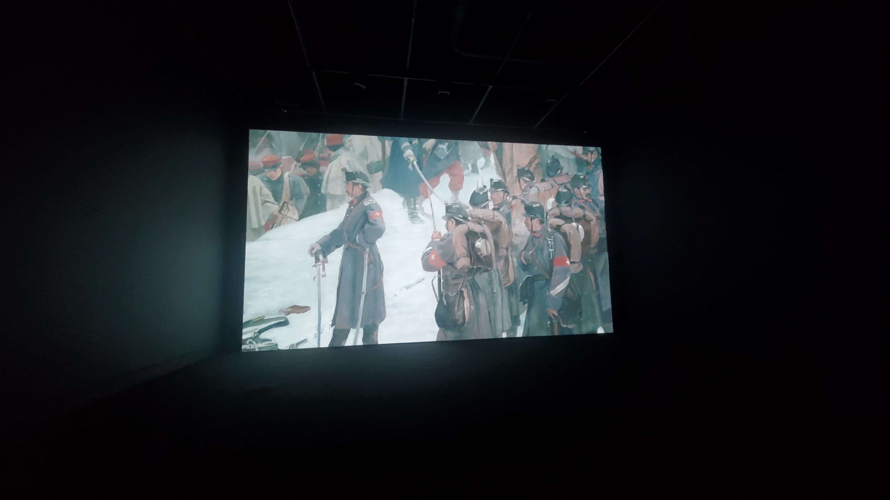
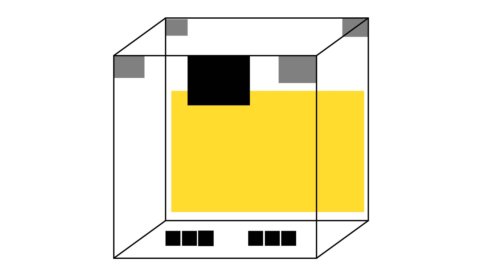
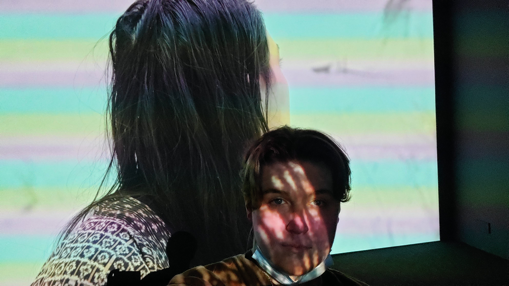
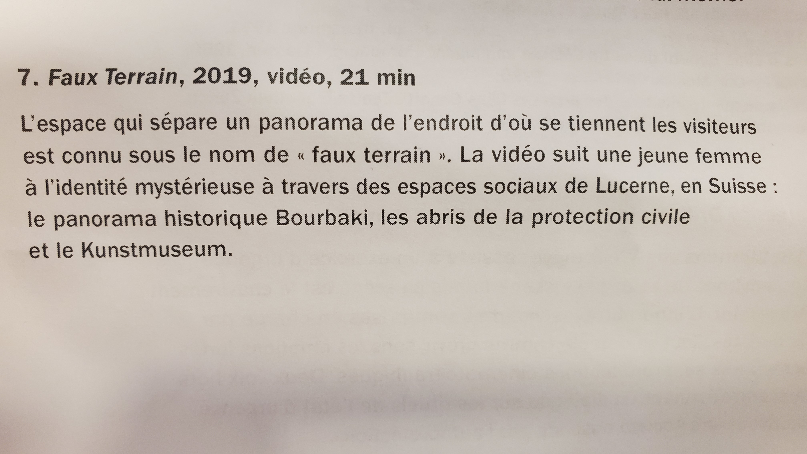
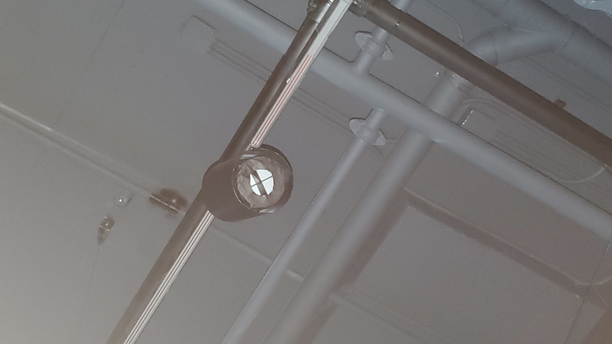
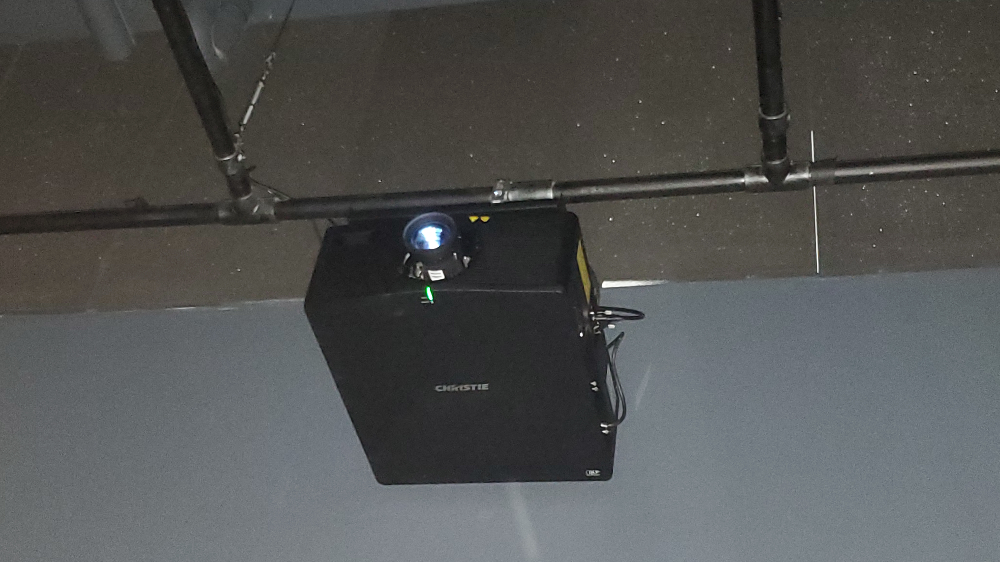
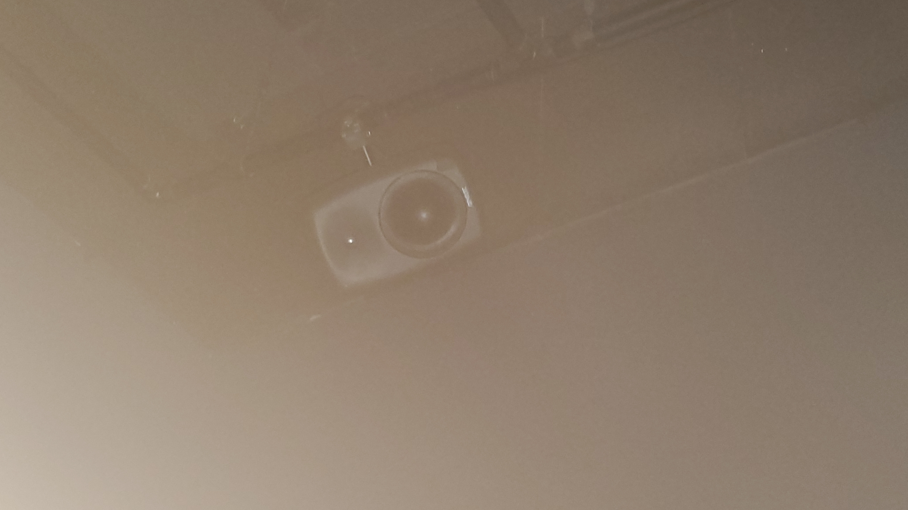
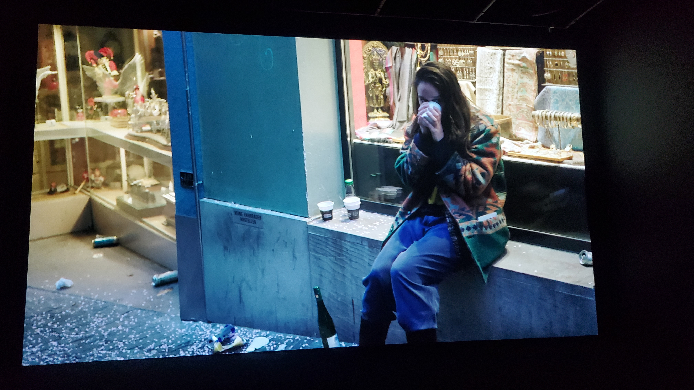
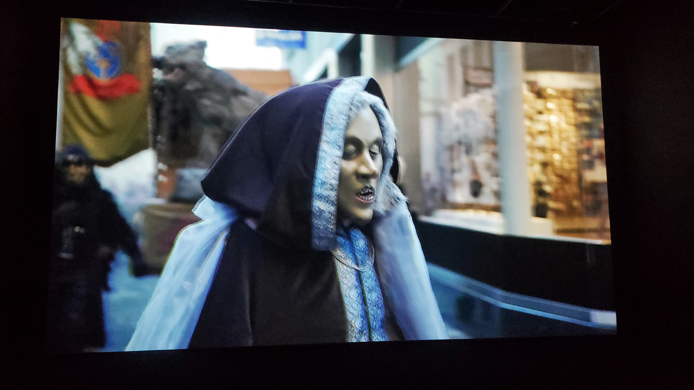
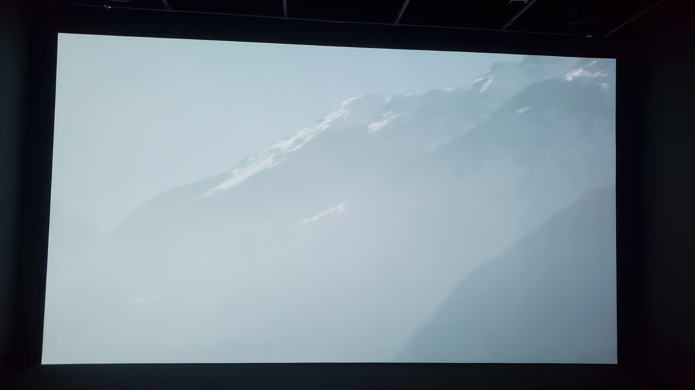

# Titre de l'oeuvre ou de la réalisation 

Faux Terrain

## Nom de l'artiste ou de la firme

Clemens von Wedemeyer

## Année de réalisation

2019

## Nom de l'exposition ou de l'événement 

The Illusion of a Crowd

## Lieu de mise en exposition 

Centre VOX, 2 rue Sainte-Catherine East, Montreal (QC), H2X 1K4

## Date de votre visite 

3 mai 2022 

## Description de l'oeuvre ou du dispositif multimédia 

L'espace qui sépare un panorama de l'endroit d'où se tiennent les visiteurs est connu sous le nom de << faux terrain >>. La vidéo suit une jeune femme à l'identité mystérieuse à travers des espaces sociaux de Lucerne, en Suisse : le panorama historique Bourbaki, les abris de la protection civile et le Kunstmuseum.

source: cartel

## Explications sur la mise en espace de l'oeuvre ou du dispositif 

C'est dans une pièce toute noir et insonorisée que l'oeuvre est présentée. En arrivant dans la pièce, un détecteur de mouvement nous allume le projecteur. Ensuite, nous pouvons profiter de l'oeuvre grâce au 4 haut-parleurs répartient aux 4 coins de la pièce. Tout ce système est installé au plafond avec des supports.

## Liste des composantes et techniques de l'oeuvre ou du dispositif 

1 projecteur
1 détecteur de mouvement
4 haut-parleur
1 ordinateur

## Liste des éléments nécessaires pour la mise en exposition 

Une pièces assez grande qui doit être noir et insonorisée. Il doit y avoir des support au plafond sur lesquels tout les fils sont attachés.

## Expérience vécue 

En écoutant la vidéo, l'artiste arrive à te faire sentir tout comme le personnage de l'histoire. Tu te sens totalement comme un spectateur de la foule et de tout ses vices. De plus, le VOX n'est pas souvent plein ce qui permet vraiment à l'utilisateur un vrai sentiment de solitude.

## Description de votre expérience de l'oeuvre ou du dispositif, de l'interactivité, des gestes à poser, etc. 

Il n'y a aucun geste à poser puisqu'il s'agit d'une oeuvre contemplative.

## Ce qui vous a plu, vous a donné des idées et justifications 

J'ai beaucoup aimé le fait que je me sentais comme le personnage. J'aime l'idée de retransmettre l'ambience d'une vidéo dans l'environnement de l'utilisateur.

## Aspect que vous ne souhaiteriez pas retenir pour vos propres créations ou que vous feriez autrement et justifications 

Je trouve que c'était trop long pour le peu de contenu réelement utile. Je pense que 10 minutes auraient été suffisantes pour tout voir sans perdre l'attention de l'utilisateur.

## Références
Site de l'exposition:
http://centrevox.ca/exposition/clemens-von-wedemeyer/

Cartel de l'oeuvre:

